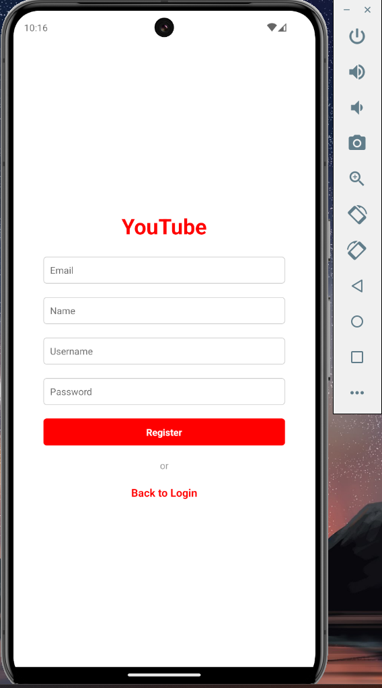

## Pre-requisite

Need ngrok to run the server on your local machine. You can download it [here](https://ngrok.com/download).
need expo go to run the app on your phone. You can download it [here](https://play.google.com/store/apps/details?id=host.exp.exponent&hl=en&gl=US).

## My Social Media App (youtube themed)

My Social Media App adalah sebuah aplikasi client(mobile)-server. Challenge ini juga merupakan salah satu aplikasi mobile pertama dan terakhir kamu, jadi kerjakan dengan baik sebagai bekal portofolio kamu. Pada challenge ini, kamu diminta untuk membuat aplikasi client(mobile)-server dengan detail sebagai berikut:

### Struktur Folder

- [x] server: untuk menyimpan aplikasi server GraphQL kamu
- [x] app: untuk menyimpan aplikasi mobile React Native kamu

### Fitur

- [x] Fitur Register
- [x] Fitur Login
- [x] FItur Add Post
- [x] Fitur Show Post (berdasarkan yang paling baru)
- [x] Fitur Comment Post (Embedded Document)
- [x] Fitur search user berdasarkan nama atau username
- [x] Fitur follow
- [x] Menampilkan Followers dan Following dari setiap user (Reference with $lookup)
- [x] Fitur Like Post
- [x] Menampilkan total like dari setiap post
